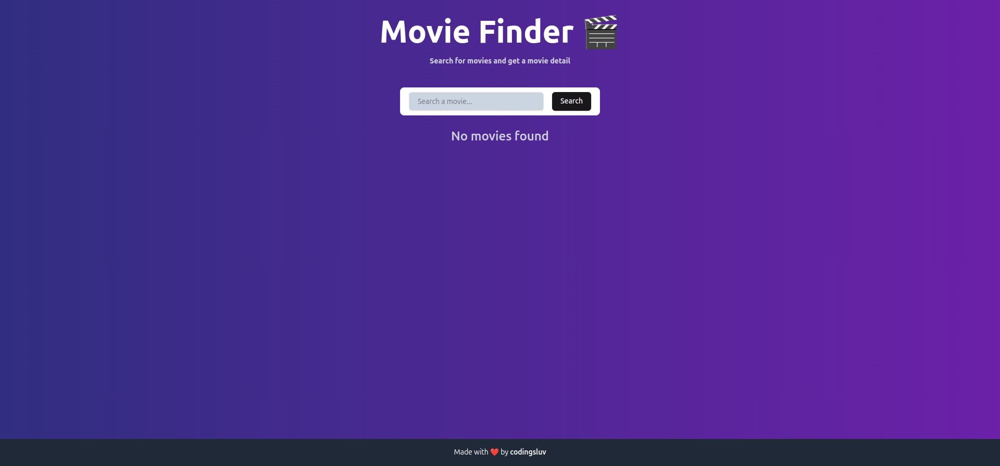
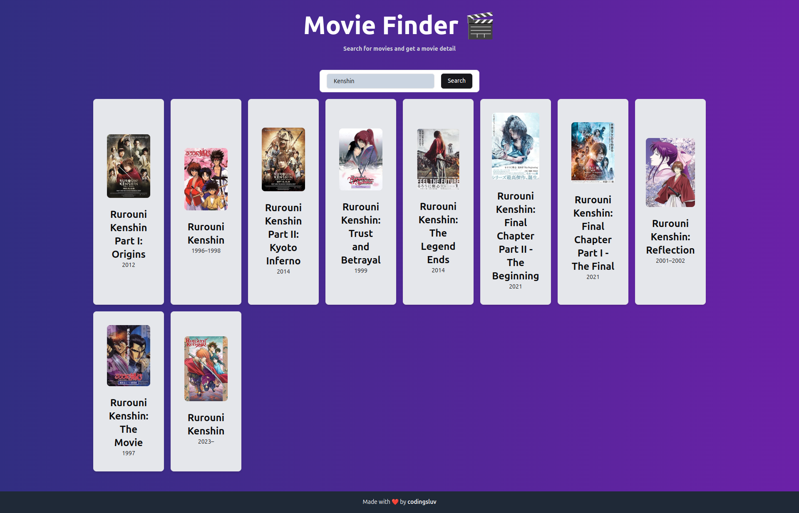
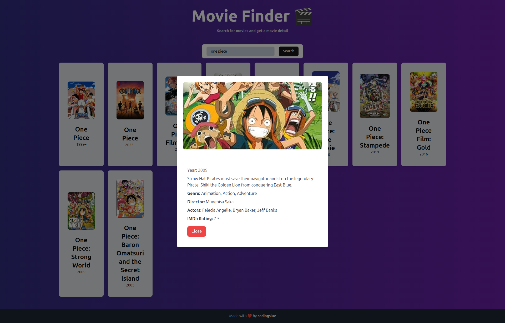

# Movie Finder

Movie Finder is a web application that allows users to search for movies and view detailed information about them. The app utilizes the OMDB API to fetch movie data and display it in a user-friendly interface.

## Features
- **Search Movies**: Users can search for movies by title.
- **Movie List**: Displays a list of movies based on the search query.
- **Movie Details**: Clicking on a movie shows detailed information, including the poster, plot, genre, director, actors, and IMDb rating.
- **Responsive Design**: The app is responsive and works well on different devices.

## Technologies Used
- **React**: For building the user interface.
- **TypeScript**: For type-safe JavaScript.
- **Tailwind CSS**: For styling the application.
- **OMDB API**: For fetching movie data.

## Setup and Installation

1. **Clone the repository**:
   ```bash
   git clone https://github.com/yourusername/movie-finder.git
   cd movie-finder
   ```

2. **Install dependencies**:
   ```bash
   npm install
   ```

3. **Set up environment variables**:
   - Create a `.env` file in the root of your project.
   - Add your OMDB API key:
     ```
     REACT_APP_OMDB_API_KEY=your_api_key_here
     ```

4. **Run the application**:
   ```bash
   npm start
   ```
   The app will be available at `http://localhost:3000`.

## Usage

1. Enter a movie title in the search bar and click the search button.
2. Browse the list of movies matching your search query.
3. Click on a movie card to view more details.
4. Use the close button to return to the movie list.

## Screenshots

### Home Page


### Movie List


### Movie Modal


## Credits
- [OMDB API](http://www.omdbapi.com/) for providing movie data.
- Created by **codingsluv**.

## License
This project is licensed under the MIT License. See the LICENSE file for details.

